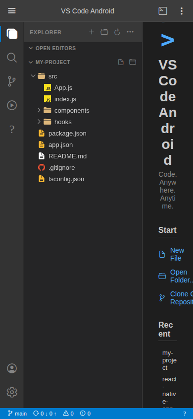
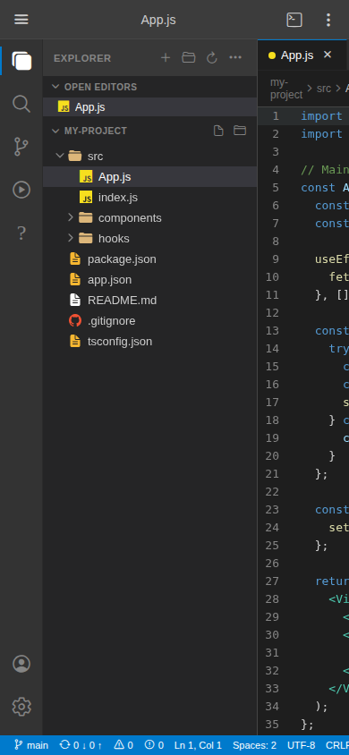
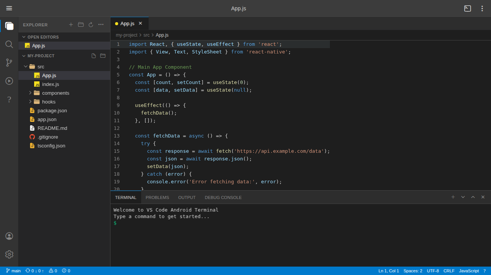

# VS Code Android

A VS Code-like code editor app for Android built with React Native (Expo). It faithfully recreates the VS Code experience on mobile devices with the same dark theme, UI layout, and core functionality.

[](https://github.com/ogtanmay/sturdy-octo-spoon/actions/workflows/build-android.yml)

## Screenshots

### Welcome Screen


### Code Editor with Syntax Highlighting


### Full Editor with Terminal


## Features

- **VS Code Dark+ Theme** — Exact same color scheme as VS Code
- **Activity Bar** — Left sidebar icons (Explorer, Search, Git, Debug, Extensions)
- **File Explorer** — File tree with folder expand/collapse and icons
- **Code Editor** — Syntax highlighted code viewer with line numbers
- **Syntax Highlighting** — Support for JavaScript, TypeScript, JSON, Markdown, and more
- **Tab Bar** — Multiple files open in tabs
- **Breadcrumb Navigation** — File path shown above the editor
- **Terminal Panel** — Interactive terminal with simulated command output
- **Search Panel** — Search across files with case-sensitive and regex options
- **Status Bar** — VS Code-style status bar with git branch, cursor position, encoding
- **Welcome Screen** — VS Code-style welcome screen with recent files

## Install the APK on Android

The easiest way to get the app on your phone is to download the APK built by GitHub Actions:

1. Go to the **[Actions tab](https://github.com/ogtanmay/sturdy-octo-spoon/actions/workflows/build-android.yml)**
2. Click the latest successful **"Build Android APK"** run
3. Download the `vs-code-android-debug-apk` artifact
4. Extract the `.apk` file and transfer it to your Android device
5. On your device, open the APK file — you may need to enable **"Install from unknown sources"** in Settings → Security

## Build Locally

### Prerequisites

- Node.js >= 18
- Java 17 (for Android builds)
- Android SDK (for native builds)
- [Expo Go](https://expo.dev/go) app (for development/preview)

### Development (Expo Go)

```bash
cd VsCodeAndroid
npm install
npm start         # Scan the QR code with Expo Go
```

### Build Debug APK (no signing required — can be sideloaded)

```bash
cd VsCodeAndroid
npm install

# Step 1: Generate native Android project
npm run prebuild:android

# Step 2: Build the APK
npm run build:android:debug
# APK will be at: android/app/build/outputs/apk/debug/app-debug.apk
```

### Build via EAS (Expo Application Services) — signed release APK

> Requires a free [Expo account](https://expo.dev/signup) and `EXPO_TOKEN`.

```bash
cd VsCodeAndroid
npm install
npm install -g eas-cli
eas login
npm run build:eas:preview    # Produces a signed APK
npm run build:eas:production # Produces a signed AAB for Play Store
```

### Running on Web (for preview)

```bash
npm run web
```

## GitHub Actions Workflow

The workflow at `.github/workflows/build-android.yml` automatically builds the APK on every push that changes files in `VsCodeAndroid/`. It has two jobs:

| Job | When it runs | Output |
|-----|-------------|--------|
| **build-local** | Every push / PR | Debug APK uploaded as artifact (`vs-code-android-debug-apk`) |
| **build-eas** | Only when `EXPO_BUILD_ENABLED` variable is `true` | Signed APK built on Expo's cloud |

To trigger a manual build with a specific profile, go to **Actions → Build Android APK → Run workflow**.

## Project Structure

```
VsCodeAndroid/
├── App.js                     # Main app entry point
├── app.json                   # Expo configuration (package name, versionCode)
├── eas.json                   # EAS Build profiles (preview APK, production AAB)
├── src/
│   ├── components/
│   │   ├── ActivityBar.js     # Left sidebar icons
│   │   ├── AppStatusBar.js    # Bottom status bar
│   │   ├── CodeEditor.js      # Code editor with syntax highlighting
│   │   ├── FileExplorer.js    # File tree explorer
│   │   ├── SearchPanel.js     # Search panel
│   │   ├── TabBar.js          # File tabs
│   │   └── Terminal.js        # Terminal/panel area
│   ├── data/
│   │   └── sampleFiles.js     # Sample project file structure
│   └── theme/
│       └── vsCodeTheme.js     # VS Code Dark+ theme colors
└── screenshots/               # App screenshots
```

## Technology Stack

- **React Native** with [Expo](https://expo.dev/) ~54
- **EAS Build** for producing installable Android APKs
- **@expo/vector-icons** for Ionicons
- **react-native-web** for web preview
- Custom syntax tokenizer for code highlighting

